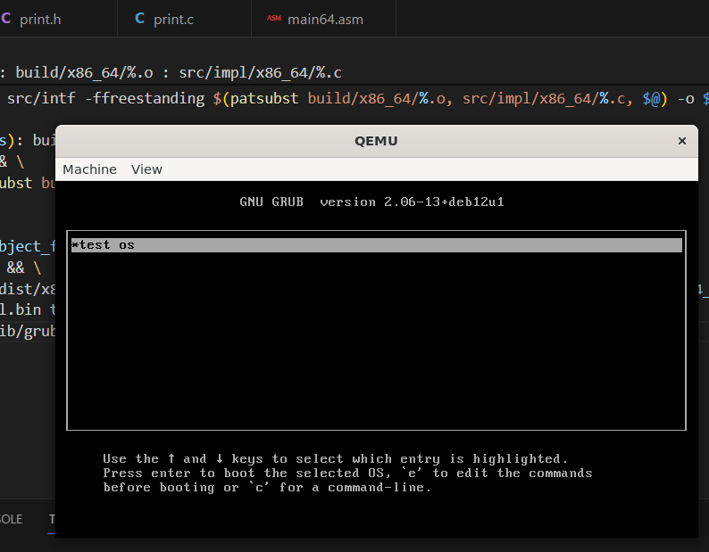
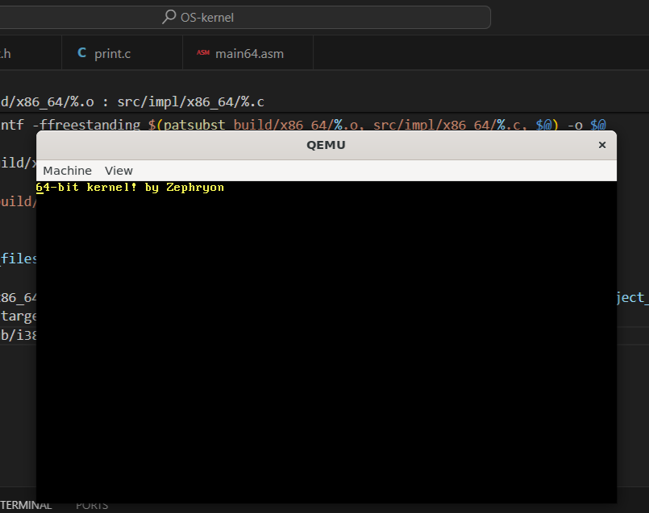

# A 64-bit Operating system kernel from scratch

This repository houses a custom operating system kernel along with a Docker container for streamlined development and testing.

# Demo




## Prerequisites:

- A text editor such as `Vim` or [VSCode](https://code.visualstudio.com/).
- [Docker](https://www.docker.com/) for creating our build environment.
- [Qemu](https://www.qemu.org/) for emulating our operating system.
    - Remember to add Qemu to the path so that you can access it from your command-line. ([Windows instructions here](https://dev.to/whaleshark271/using-qemu-on-windows-10-home-edition-4062))
    - or download it in wsl

## Setup

Build an image for our build-environment:
```bash
docker build buildenv -t test-buildenv
```

Enter build environment:
 - Linux or MacOS: `docker run --rm -it -v "$(pwd)":/root/env test-buildenv`
 - Windows (CMD): `docker run --rm -it -v "%cd%":/root/env test-buildenv`
 - Windows (PowerShell): `docker run --rm -it -v "${pwd}:/root/env" test-buildenv`
 - Use the linux command if you are using `WSL`, `msys2` or `git bash`

Build for x86 (other architectures may come in the future):
```bash
make build-x86_64
```

To leave the build environment, enter `exit`.

## Emulate

You can emulate your operating system using [Qemu](https://www.qemu.org/): (Don't forget to [add qemu to your path](https://dev.to/whaleshark271/using-qemu-on-windows-10-home-edition-4062#:~:text=2.-,Add%20Qemu%20path%20to%20environment%20variables%20settings,-Copy%20the%20Qemu)!)

```bash
qemu-system-x86_64 -cdrom dist/x86_64/kernel.iso
 ```
 - Note: Close the emulator when finished, so as to not block writing to `kernel.iso` for future builds.

Alternatively, you should be able to load the operating system on a flash drive and boot into it.
 
## Cleanup

Remove the build-evironment image:
 ```bash
docker rmi myos-buildenv -f
```
